# 币安量化交易系统 — 系统架构设计

> 版本: v1.0 | 更新日期: 2026-03-13 | 面向: 研发团队

---

## 目录

1. [整体系统架构](#1-整体系统架构)
2. [技术选型](#2-技术选型)
3. [核心模块详细设计](#3-核心模块详细设计)
4. [部署架构](#4-部署架构)
5. [数据流图](#5-数据流图)

---

## 1. 整体系统架构

### 1.1 系统模块关系图

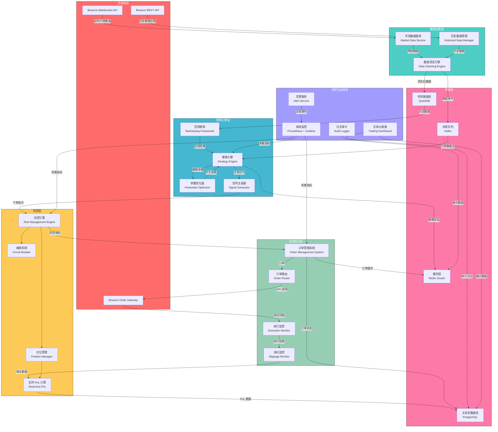

### 1.2 架构选型：微服务架构

**选型结论：采用微服务架构，但初期以"模块化单体"起步，逐步拆分。**

| 维度 | 单体架构 | 微服务架构 | 我们的选择 |
|------|---------|-----------|-----------|
| 部署复杂度 | 低 | 高 | 初期单体，降低运维成本 |
| 模块间延迟 | 极低（进程内调用） | 较高（网络调用） | 性能关键路径保持进程内通信 |
| 独立扩缩容 | 不支持 | 支持 | 策略引擎和数据服务需要独立扩展 |
| 技术栈异构 | 困难 | 天然支持 | Python + Go/Rust 必须异构 |
| 故障隔离 | 差 | 好 | 风控和交易执行必须隔离 |

**渐进式拆分路径：**

```
Phase 1 (MVP): 模块化单体
  ├── Python 单体: 数据采集 + 策略引擎 + 回测
  └── Go 服务: 订单执行 + 风控

Phase 2 (稳定期): 核心拆分
  ├── Market Data Service (Python)
  ├── Strategy Engine (Python)
  ├── Order Execution Service (Go)
  ├── Risk Management Service (Go)
  └── Monitoring Dashboard (TypeScript)

Phase 3 (规模化): 完全微服务
  └── 按交易对 / 策略类型进一步水平拆分
```

---

## 2. 技术选型

### 2.1 编程语言

| 层次 | 语言 | 理由 |
|------|------|------|
| 策略研发 & 回测 | **Python 3.12+** | 丰富的量化库生态（numpy、pandas、ta-lib）、快速原型迭代、Jupyter 交互式研发 |
| 交易执行 & 风控 | **Go 1.22+** | 高并发、低延迟、内存安全、goroutine 天然适合 WebSocket 长连接管理 |
| 高频关键路径 | **Rust**（可选） | 订单簿维护、撮合模拟等对延迟极度敏感的模块，后期按需引入 |
| 前端监控面板 | **TypeScript + React** | 类型安全、丰富的可视化库（ECharts、TradingView Lightweight Charts） |
| 脚本 & 胶水 | **Python / Shell** | 数据迁移、定时任务、运维脚本 |

### 2.2 消息队列

**选型：Apache Kafka**

| 方案 | 吞吐量 | 延迟 | 持久化 | 回放能力 | 选择理由 |
|------|--------|------|--------|---------|---------|
| **Kafka** | 极高 | 毫秒级 | 强 | 支持 | 行情数据天然是事件流，Kafka 分区模型完美匹配按交易对分流 |
| RabbitMQ | 中 | 微秒级 | 可选 | 不支持 | 延迟更低但不支持历史回放，不利于回测数据重放 |
| Redis Streams | 高 | 微秒级 | 弱 | 有限 | 适合轻量级场景，持久化能力不足以支撑完整行情存储 |

**Kafka Topic 设计：**

```
binance.market.{symbol}.ticker    # 实时 Ticker
binance.market.{symbol}.depth     # 深度数据
binance.market.{symbol}.kline     # K 线数据
binance.market.{symbol}.trade     # 逐笔成交
trading.signal.{strategy_id}      # 交易信号
trading.order.{symbol}            # 订单事件
trading.execution.{symbol}        # 成交回报
risk.alert                        # 风控告警
system.metrics                    # 系统指标
```

### 2.3 数据库

| 类型 | 选型 | 用途 | 理由 |
|------|------|------|------|
| 时序数据库 | **QuestDB** | K线、Tick数据、指标时序 | 列式存储、SQL 兼容、写入性能优异（百万行/秒）、比 InfluxDB 查询更快 |
| 关系型数据库 | **PostgreSQL 16** | 订单、持仓、策略配置、用户管理 | ACID 保证、JSONB 灵活 schema、成熟的生态 |
| 缓存 | **Redis 7 Cluster** | 实时行情快照、订单状态缓存、分布式锁、限流 | 亚毫秒延迟、丰富的数据结构、Pub/Sub 能力 |
| 对象存储 | **MinIO / S3** | 回测报告、日志归档、模型文件 | 兼容 S3 API、可自托管 |

**数据生命周期管理：**

```
实时数据 (< 1h)     → Redis (内存)
近期数据 (1h ~ 30d)  → QuestDB (SSD)
历史数据 (30d ~ 2y)  → QuestDB (HDD 分区)
归档数据 (> 2y)      → S3/MinIO (冷存储)
```

### 2.4 容器化与编排

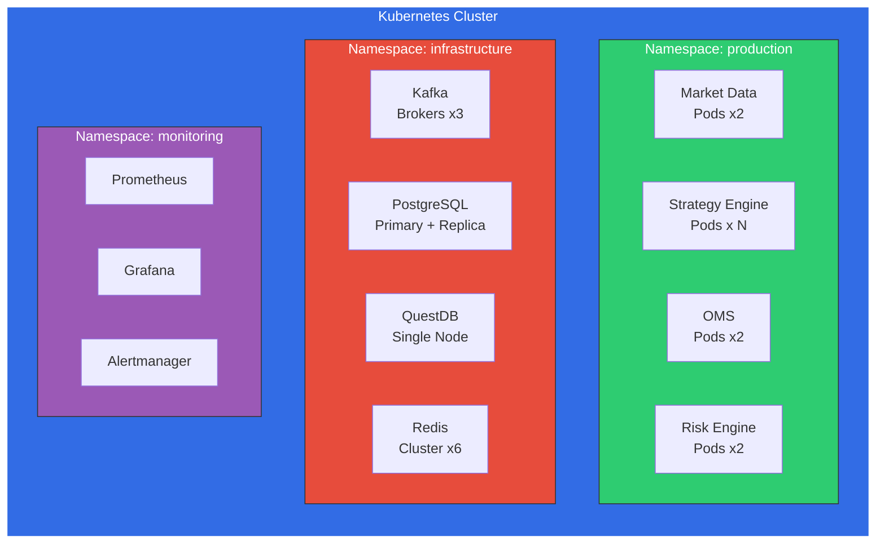

**Docker 镜像策略：**

| 服务 | 基础镜像 | 构建方式 |
|------|---------|---------|
| Python 服务 | `python:3.12-slim` | 多阶段构建，poetry 管理依赖 |
| Go 服务 | `golang:1.22-alpine` → `scratch` | 静态编译，最终镜像 < 20MB |
| 前端 | `node:22-alpine` → `nginx:alpine` | Vite 构建 → Nginx 托管 |

### 2.5 CI/CD 流水线

```mermaid
graph LR
    DEV["开发者<br/>git push"] --> LINT["代码检查<br/>Lint + Format"]
    LINT --> TEST["自动化测试<br/>Unit + Integration"]
    TEST --> BUILD["Docker 构建<br/>多阶段构建"]
    BUILD --> SCAN["安全扫描<br/>Trivy + Snyk"]
    SCAN --> STAGE["部署 Staging<br/>模拟盘验证"]
    STAGE --> APPROVE["人工审批<br/>策略负责人"]
    APPROVE --> PROD["部署 Production<br/>金丝雀发布"]
    PROD --> VERIFY["生产验证<br/>Smoke Test"]

    style DEV fill:#3498db,stroke:#333,color:#fff
    style TEST fill:#2ecc71,stroke:#333,color:#fff
    style APPROVE fill:#e74c3c,stroke:#333,color:#fff
    style PROD fill:#e67e22,stroke:#333,color:#fff
```

**关键原则：**

- 策略代码变更**必须**经过回测验证 + 模拟盘运行 24h 后才能上线实盘
- 基础设施变更（风控参数、交易执行逻辑）采用**蓝绿部署**
- 所有部署可一键回滚，回滚时间 < 30s

---

## 3. 核心模块详细设计

### 3.1 市场数据服务（Market Data Service）

#### 3.1.1 架构概览

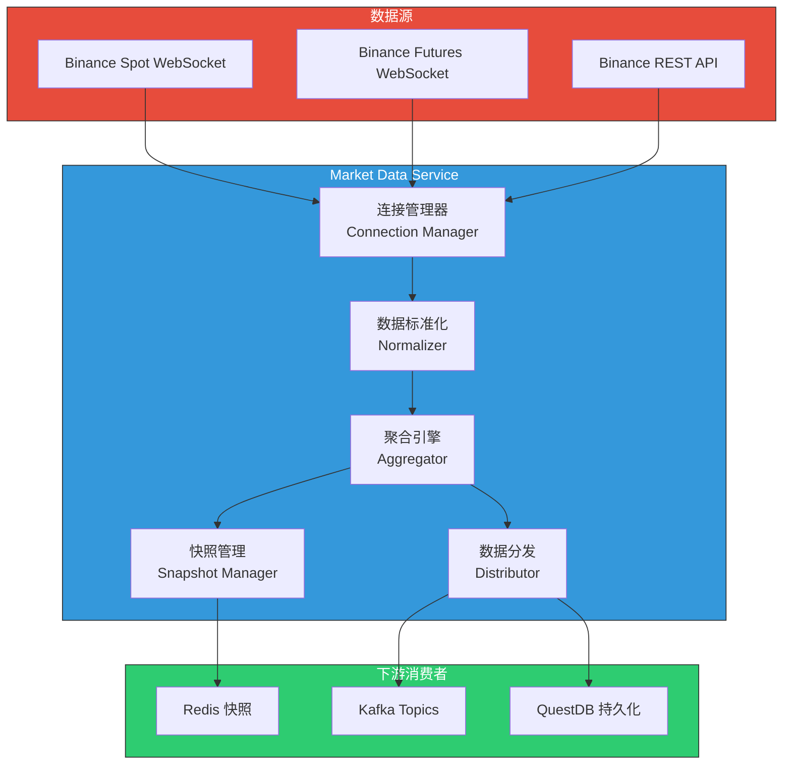

#### 3.1.2 实时行情采集

**WebSocket 连接管理：**

```python
# 连接管理器核心设计
class ConnectionManager:
    """
    管理与 Binance 的 WebSocket 连接池。

    设计要点:
    - 每个连接最多订阅 200 个 stream（Binance 限制）
    - 自动重连: 指数退避 (1s → 2s → 4s → ... → 60s max)
    - 心跳检测: 每 30s 发送 pong，超过 90s 无响应则重连
    - 连接轮换: 每 23h 主动重建连接（Binance 24h 强制断开）
    """

    MAX_STREAMS_PER_CONN = 200
    HEARTBEAT_INTERVAL = 30  # seconds
    RECONNECT_MAX_DELAY = 60  # seconds
    CONNECTION_ROTATE_INTERVAL = 23 * 3600  # seconds
```

**订阅的数据流：**

| 数据类型 | Stream 名称 | 频率 | 用途 |
|---------|------------|------|------|
| 逐笔成交 | `{symbol}@trade` | 实时 | 成交价格、成交量追踪 |
| 深度数据 | `{symbol}@depth@100ms` | 100ms | 订单簿维护、流动性分析 |
| K 线 | `{symbol}@kline_{interval}` | 按周期 | 技术指标计算 |
| Ticker | `{symbol}@ticker` | 1s | 价格概览、涨跌幅 |
| 标记价格 | `{symbol}@markPrice` | 3s | 合约标记价格（仅期货） |

#### 3.1.3 历史数据管理

```python
class HistoricalDataManager:
    """
    历史数据拉取与管理。

    策略:
    - 首次部署: 批量拉取近 2 年 K 线数据（REST API，限速 1200 req/min）
    - 增量更新: 每分钟检查数据缺口，自动补全
    - 数据校验: 每日凌晨校验前一日数据完整性（K线连续性、成交量一致性）
    """

    SUPPORTED_INTERVALS = [
        "1m", "3m", "5m", "15m", "30m",
        "1h", "2h", "4h", "6h", "8h", "12h",
        "1d", "3d", "1w", "1M"
    ]

    # REST API 限速控制
    RATE_LIMIT = 1200  # requests per minute
    BATCH_SIZE = 1000  # max candles per request
```

#### 3.1.4 数据清洗与对齐

**清洗规则：**

| 规则 | 描述 | 处理方式 |
|------|------|---------|
| 时间戳对齐 | 将所有数据对齐到统一时间基准 | 线性插值或最近邻填充 |
| 异常值检测 | 价格偏离移动均线 > 5 个标准差 | 标记为异常，不参与策略计算 |
| 数据缺口 | 连续缺失超过 5 个周期 | 触发告警 + REST API 补全 |
| 重复数据 | 相同时间戳的重复推送 | 幂等处理，保留最新值 |
| 精度标准化 | 不同交易对的价格/数量精度不同 | 根据 exchangeInfo 统一精度处理 |

#### 3.1.5 数据分发机制

采用**扇出模式（Fan-out）**，一份原始数据分发到多个目的地：

```
原始行情 → Kafka (事件流，供策略引擎消费)
         → Redis (最新快照，供 API 查询)
         → QuestDB (持久化，供回测使用)
```

分发采用异步非阻塞写入，任何一个下游故障不影响其他下游。QuestDB 写入通过批量缓冲（每 100ms 或 1000 条刷盘一次）降低 I/O 压力。

---

### 3.2 策略引擎（Strategy Engine）

#### 3.2.1 策略生命周期

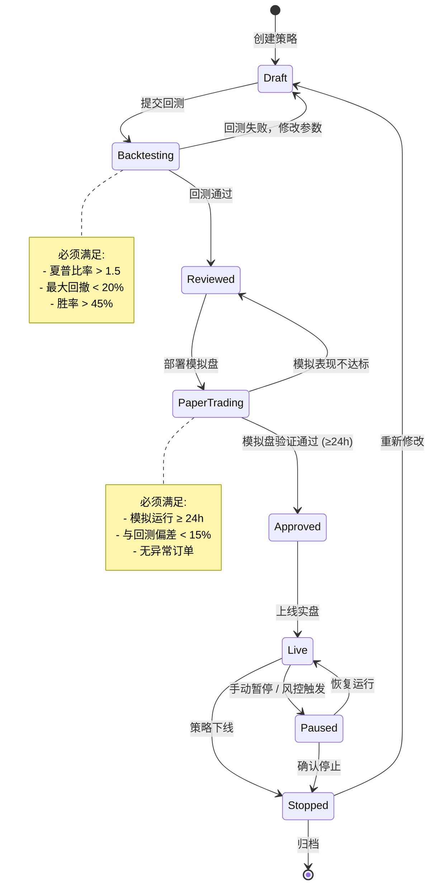

#### 3.2.2 策略抽象接口

```python
from abc import ABC, abstractmethod
from dataclasses import dataclass
from enum import Enum

class SignalType(Enum):
    LONG_ENTRY = "long_entry"
    LONG_EXIT = "long_exit"
    SHORT_ENTRY = "short_entry"
    SHORT_EXIT = "short_exit"
    HOLD = "hold"

@dataclass
class Signal:
    signal_type: SignalType
    symbol: str
    price: float
    quantity: float
    confidence: float  # 0.0 ~ 1.0
    metadata: dict     # 策略特定的附加信息

class BaseStrategy(ABC):
    """所有策略的基类。"""

    @abstractmethod
    def on_init(self, context: StrategyContext) -> None:
        """策略初始化，加载参数、预热指标。"""
        ...

    @abstractmethod
    def on_bar(self, bar: Bar) -> list[Signal]:
        """K 线闭合时触发，返回交易信号列表。"""
        ...

    @abstractmethod
    def on_tick(self, tick: Tick) -> list[Signal]:
        """逐笔成交触发（高频策略使用）。"""
        ...

    @abstractmethod
    def on_order_filled(self, order: Order) -> None:
        """订单成交回调，更新策略内部状态。"""
        ...

    @abstractmethod
    def on_stop(self) -> None:
        """策略停止时清理资源。"""
        ...

    def get_parameters(self) -> dict:
        """返回策略可调参数及其范围，用于参数优化。"""
        return {}
```

#### 3.2.3 回测框架设计

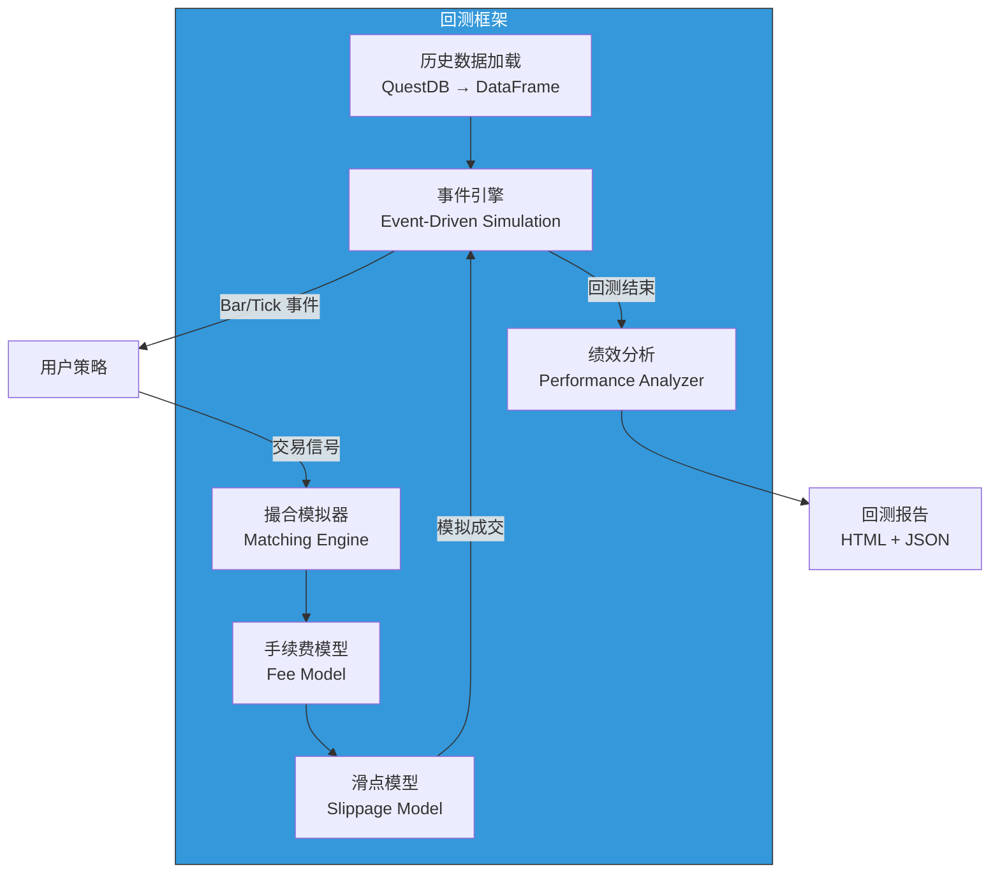

**撮合模拟器规则：**

| 订单类型 | 撮合逻辑 |
|---------|---------|
| 市价单 | 下一个 Bar 的开盘价 + 滑点 |
| 限价单 | Bar 的 High/Low 触及限价时成交 |
| 止损单 | Bar 的 High/Low 穿过止损价时按止损价成交 |

**滑点模型：**

```python
class SlippageModel:
    """
    基于成交量的滑点估算。

    slippage = base_slippage + volume_impact
    volume_impact = order_size / avg_volume * impact_factor
    """
    BASE_SLIPPAGE_BPS = 1.0   # 基础滑点: 1 bp (0.01%)
    IMPACT_FACTOR = 5.0        # 冲击因子
```

**绩效指标：**

| 指标 | 公式/说明 | 合格阈值 |
|------|---------|---------|
| 年化收益率 | CAGR | > 15% |
| 夏普比率 | (R_p - R_f) / σ_p | > 1.5 |
| 最大回撤 | Max Drawdown | < 20% |
| 索提诺比率 | (R_p - R_f) / σ_downside | > 2.0 |
| 胜率 | Winning Trades / Total Trades | > 45% |
| 盈亏比 | Avg Win / Avg Loss | > 1.5 |
| 卡尔玛比率 | CAGR / Max Drawdown | > 1.0 |

#### 3.2.4 实盘/模拟盘切换

通过**交易执行层的适配器模式**实现零代码切换：

```python
class ExecutionAdapter(ABC):
    @abstractmethod
    async def place_order(self, order: Order) -> OrderResult: ...

    @abstractmethod
    async def cancel_order(self, order_id: str) -> bool: ...

    @abstractmethod
    async def get_position(self, symbol: str) -> Position: ...

class LiveExecutionAdapter(ExecutionAdapter):
    """实盘适配器：调用 Binance API。"""
    ...

class PaperExecutionAdapter(ExecutionAdapter):
    """模拟盘适配器：本地撮合，记录到数据库。"""
    ...
```

策略代码完全不感知当前是实盘还是模拟盘，由配置文件控制：

```yaml
# strategy-config.yaml
strategy:
  id: "momentum_btc_001"
  mode: "paper"  # "paper" | "live"
  execution:
    paper:
      initial_balance: 10000  # USDT
      fee_rate: 0.001         # 0.1%
    live:
      api_key_ref: "binance-main"
      max_position_pct: 0.3   # 单策略最大仓位占比
```

#### 3.2.5 策略参数优化

```python
class ParameterOptimizer:
    """
    多目标参数优化器。

    支持的优化方法:
    - Grid Search: 穷举，适合参数空间小 (< 1000 组合)
    - Random Search: 随机采样，适合高维参数空间
    - Bayesian Optimization (Optuna): 智能搜索，适合耗时长的回测
    - Walk-Forward Analysis: 滚动窗口优化，防止过拟合

    防过拟合措施:
    - 样本内/样本外分离 (70%/30%)
    - Walk-Forward 滚动验证
    - 参数稳定性检验（相邻参数组合绩效方差 < 阈值）
    - 最小交易次数要求 (> 100 笔)
    """

    OPTIMIZATION_METHODS = ["grid", "random", "bayesian", "walk_forward"]
    IN_SAMPLE_RATIO = 0.7
    MIN_TRADES = 100
```

---

### 3.3 订单管理系统（OMS）

#### 3.3.1 订单路由

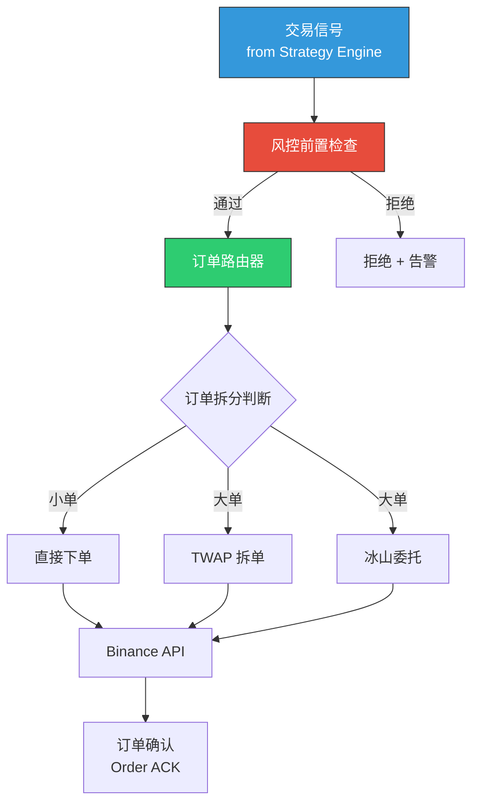

**智能订单拆分规则：**

| 条件 | 策略 | 描述 |
|------|------|------|
| 订单量 < 平均成交量 1% | 直接下单 | 对市场冲击可忽略 |
| 订单量 1% ~ 5% 平均成交量 | TWAP | 按时间均匀拆分，每 30s 一笔 |
| 订单量 > 5% 平均成交量 | 冰山委托 | 每笔展示量为总量的 10%，间隔随机 |

#### 3.3.2 订单状态机

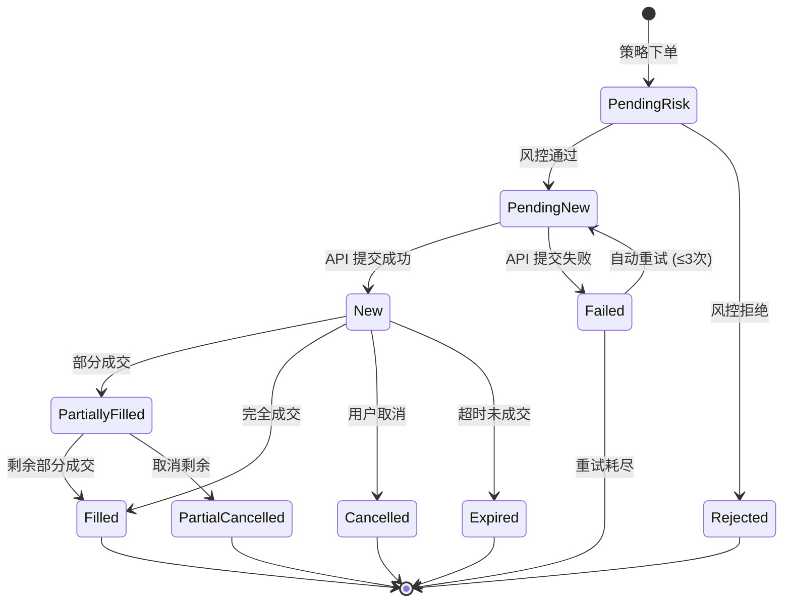

#### 3.3.3 成交撮合确认

```python
class ExecutionConfirmer:
    """
    成交确认机制，确保订单状态与交易所一致。

    三重确认:
    1. WebSocket User Data Stream: 实时推送成交事件（主通道）
    2. REST API 轮询: 每 5s 查询未确认订单（备用通道）
    3. 定时对账: 每 10min 全量对账一次（兜底机制）

    不一致处理:
    - 本地已成交但交易所未确认 → 等待 30s 后标记为 "需人工确认"
    - 本地未成交但交易所已成交 → 立即同步状态，补录成交记录
    - 数量不一致 → 触发告警，暂停相关策略
    """

    POLL_INTERVAL = 5          # seconds
    RECONCILE_INTERVAL = 600   # seconds (10min)
    CONFIRM_TIMEOUT = 30       # seconds
```

#### 3.3.4 滑点监控

```python
@dataclass
class SlippageReport:
    order_id: str
    symbol: str
    expected_price: float      # 信号价格
    actual_price: float        # 实际成交均价
    slippage_bps: float        # 滑点 (basis points)
    market_impact_bps: float   # 市场冲击
    timing_cost_bps: float     # 时机成本

class SlippageMonitor:
    """
    实时滑点监控与分析。

    告警阈值:
    - 单笔滑点 > 10 bps → WARNING
    - 单笔滑点 > 30 bps → CRITICAL，暂停策略
    - 1h 平均滑点 > 5 bps → 建议调整执行策略
    """

    WARNING_THRESHOLD_BPS = 10
    CRITICAL_THRESHOLD_BPS = 30
    HOURLY_AVG_THRESHOLD_BPS = 5
```

---

### 3.4 风控系统（Risk Management）

#### 3.4.1 风控架构

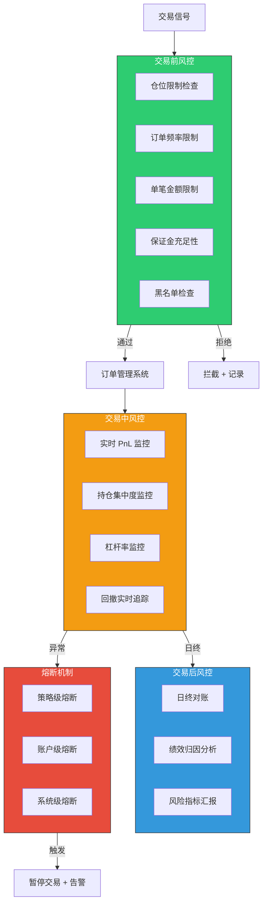

#### 3.4.2 实时 PnL 计算

```python
class RealTimePnLCalculator:
    """
    实时逐笔 PnL 计算引擎（Go 实现，此处用 Python 描述逻辑）。

    计算维度:
    - 已实现盈亏 (Realized PnL): 已平仓部分
    - 未实现盈亏 (Unrealized PnL): 按最新标记价格计算
    - 手续费消耗 (Fee Cost): 累计手续费
    - 资金费率 (Funding Cost): 仅期货，每 8h 结算

    更新频率: 每次成交事件 + 每秒行情更新
    """

    def calculate_unrealized_pnl(
        self, position: Position, mark_price: float
    ) -> float:
        if position.side == "LONG":
            return (mark_price - position.entry_price) * position.quantity
        else:
            return (position.entry_price - mark_price) * position.quantity
```

#### 3.4.3 仓位管理

| 限制维度 | 参数 | 默认值 | 说明 |
|---------|------|--------|------|
| 单策略最大仓位 | `max_position_per_strategy` | 30% | 占总资金比例 |
| 单交易对最大仓位 | `max_position_per_symbol` | 20% | 防止单一资产集中风险 |
| 总仓位上限 | `max_total_position` | 80% | 保留 20% 现金缓冲 |
| 单笔最大下单量 | `max_order_size` | 5% | 占可用余额比例 |
| 日内最大交易次数 | `max_daily_trades` | 500 | 防止策略失控 |
| 最大同时持仓数 | `max_concurrent_positions` | 10 | 分散风险 |

#### 3.4.4 止损/止盈逻辑

```python
class StopLossManager:
    """
    多层级止损/止盈管理。

    止损类型:
    1. 固定止损 (Fixed Stop): 入场价 - N%
    2. 追踪止损 (Trailing Stop): 最高价 - N%，只上不下
    3. ATR 止损: 入场价 - N * ATR(14)
    4. 时间止损: 持仓超过 T 小时未盈利则平仓
    5. 波动率止损: 当波动率突然放大 > 2x 均值时平仓

    止盈类型:
    1. 固定止盈: 入场价 + N%
    2. 分批止盈: 50% 仓位在 +2%, 30% 在 +5%, 20% 在 +10%
    3. 指标止盈: RSI > 80 / MACD 死叉时平仓
    """
```

#### 3.4.5 熔断机制

```python
class CircuitBreaker:
    """
    三级熔断机制。

    Level 1 - 策略级熔断:
      触发: 策略日内亏损 > 3% 或连续亏损 5 笔
      动作: 暂停该策略 30min，通知策略负责人
      恢复: 自动恢复 或 人工确认

    Level 2 - 账户级熔断:
      触发: 账户日内总亏损 > 5% 或单笔亏损 > 2%
      动作: 暂停所有策略，平掉所有非对冲仓位
      恢复: 需人工确认后恢复

    Level 3 - 系统级熔断:
      触发: 市场闪崩(BTC 5min 跌幅 > 10%) / API 异常 / 网络中断
      动作: 全系统停机，市价平掉所有仓位
      恢复: 需管理员手动恢复
    """

    STRATEGY_DAILY_LOSS_LIMIT = 0.03    # 3%
    STRATEGY_CONSECUTIVE_LOSS = 5
    ACCOUNT_DAILY_LOSS_LIMIT = 0.05     # 5%
    ACCOUNT_SINGLE_LOSS_LIMIT = 0.02    # 2%
    MARKET_CRASH_THRESHOLD = 0.10       # 10% in 5min
```

---

### 3.5 监控与告警

#### 3.5.1 监控架构

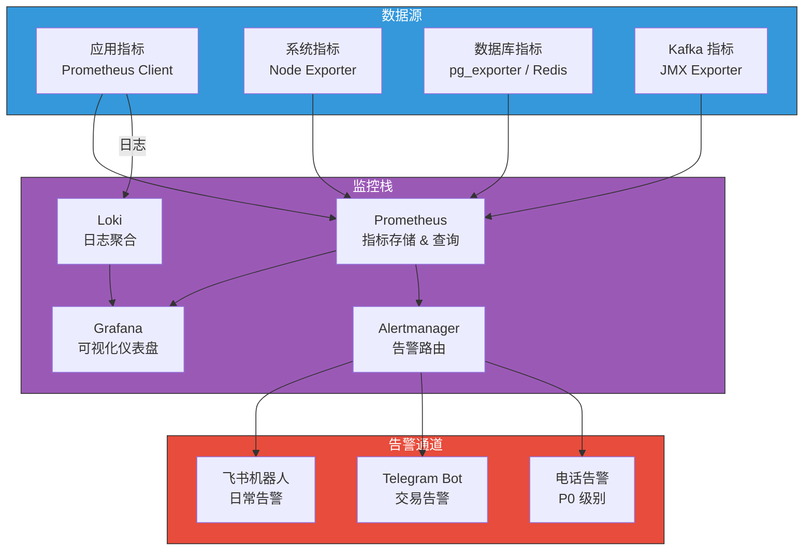

#### 3.5.2 关键监控指标

**业务指标：**

| 指标名称 | 类型 | 标签 | 告警阈值 |
|---------|------|------|---------|
| `trading_pnl_total` | Gauge | strategy, symbol | 日亏损 > 3% |
| `trading_position_value` | Gauge | strategy, symbol | > 仓位上限 |
| `trading_order_latency_ms` | Histogram | type, symbol | P99 > 500ms |
| `trading_signal_count` | Counter | strategy, signal_type | 1min > 100 |
| `trading_fill_rate` | Gauge | strategy | < 80% |
| `trading_slippage_bps` | Histogram | strategy, symbol | P95 > 10bps |

**系统指标：**

| 指标名称 | 类型 | 告警阈值 |
|---------|------|---------|
| `market_data_lag_ms` | Gauge | > 1000ms |
| `kafka_consumer_lag` | Gauge | > 10000 messages |
| `api_error_rate` | Gauge | > 1% (5min) |
| `websocket_reconnect_count` | Counter | > 5 (1h) |
| `system_cpu_usage` | Gauge | > 80% |
| `system_memory_usage` | Gauge | > 85% |

#### 3.5.3 告警分级

| 级别 | 响应时间 | 通知方式 | 示例场景 |
|------|---------|---------|---------|
| **P0 - 致命** | 立即 | 电话 + 飞书 + Telegram | 系统级熔断、API 密钥失效、资金异常 |
| **P1 - 严重** | 5min | 飞书 + Telegram | 策略级熔断、网络中断 > 30s、数据缺口 |
| **P2 - 警告** | 30min | 飞书 | 滑点异常、延迟升高、磁盘 > 80% |
| **P3 - 信息** | 下一工作日 | 飞书（静默通道） | 策略绩效日报、系统健康周报 |

#### 3.5.4 交易日志审计

```python
@dataclass
class AuditLog:
    """
    每笔交易完整审计记录。

    存储: PostgreSQL (交易表) + S3 (JSON 归档)
    保留期: 在线 90 天，归档 5 年
    """
    timestamp: datetime
    event_type: str          # signal | order | fill | cancel | risk_check
    strategy_id: str
    symbol: str
    direction: str
    price: float
    quantity: float
    order_id: str | None
    risk_check_result: dict  # 风控检查详情
    latency_ms: float        # 处理延迟
    metadata: dict           # 完整上下文快照
```

#### 3.5.5 Grafana 仪表盘规划

| 仪表盘 | 内容 | 刷新频率 |
|--------|------|---------|
| Trading Overview | 总 PnL、活跃策略数、持仓概览、资金利用率 | 5s |
| Strategy Performance | 各策略夏普、收益曲线、信号分布 | 30s |
| Execution Quality | 订单延迟、滑点分布、成交率 | 10s |
| Market Data Health | 数据延迟、连接状态、消息吞吐 | 5s |
| System Resources | CPU/内存/磁盘/网络、Kafka Lag | 15s |
| Risk Dashboard | 仓位热力图、回撤实时曲线、熔断状态 | 5s |

---

## 4. 部署架构

### 4.1 低延迟部署

#### 4.1.1 云服务器选型

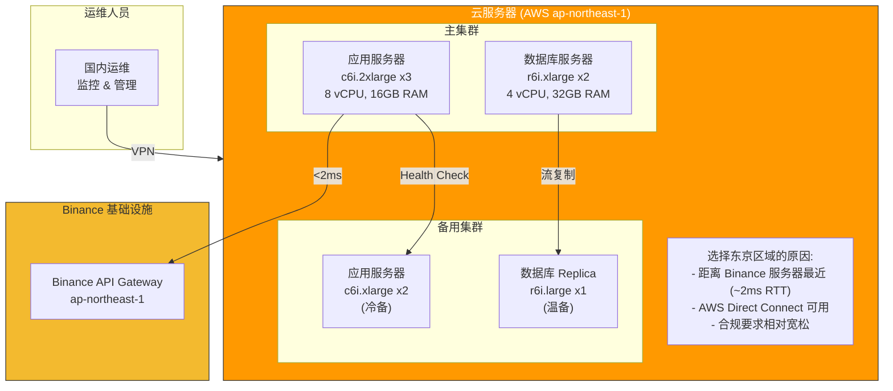

**服务器规格推荐（按阶段）：**

| 阶段 | 应用服务器 | 数据库服务器 | 月成本估算 |
|------|-----------|-----------|-----------|
| MVP (1-3 策略) | c6i.xlarge x1 | r6i.large x1 | ~$300/月 |
| 成长期 (10+ 策略) | c6i.2xlarge x2 | r6i.xlarge x1 | ~$800/月 |
| 规模化 (50+ 策略) | c6i.2xlarge x3 + 备用 | r6i.xlarge x2 | ~$2000/月 |

#### 4.1.2 延迟优化

| 优化项 | 措施 | 预期效果 |
|--------|------|---------|
| 网络 | 选择 AWS Tokyo（ap-northeast-1），与 Binance 服务器同区域 | RTT < 2ms |
| OS | 内核参数调优（tcp_nodelay, tcp_quickack, 减少 buffer bloat） | -0.5ms |
| 应用 | 连接池预热、DNS 缓存、HTTP/2 复用 | -1ms |
| 序列化 | 关键路径使用 MessagePack 替代 JSON | -0.2ms |
| GC | Go 服务调优 GOGC、Python 关键路径使用 Cython | 避免 GC 停顿 |

**目标延迟指标（信号 → 订单提交）：**

| 路径 | 目标 | 说明 |
|------|------|------|
| 信号生成 → 风控检查 | < 1ms | 进程内调用 |
| 风控通过 → API 提交 | < 2ms | 预建立连接 |
| API 提交 → Binance ACK | < 5ms | 取决于网络 |
| 全链路 E2E | < 10ms | P99 |

### 4.2 高可用设计

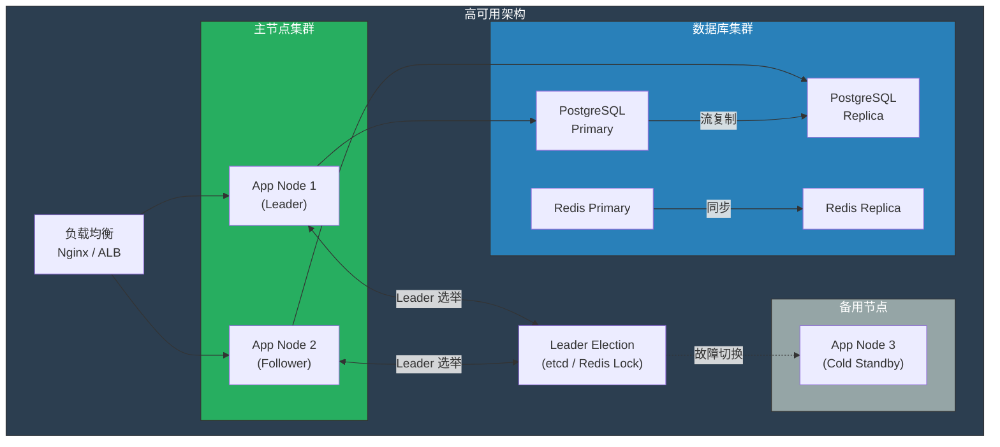

**高可用策略：**

| 组件 | 主备模式 | RTO | RPO | 切换方式 |
|------|---------|-----|-----|---------|
| 交易执行服务 | Active-Standby | < 10s | 0 | Leader 选举自动切换 |
| 策略引擎 | Active-Active | < 5s | 0 | 负载均衡自动剔除 |
| 市场数据服务 | Active-Active | < 3s | 0 | 双活，任一可独立运行 |
| PostgreSQL | Primary-Replica | < 30s | < 1s | 自动 Failover (Patroni) |
| Redis | Master-Slave | < 10s | < 1s | Sentinel 自动切换 |
| Kafka | ISR 副本 | < 5s | 0 | 自动 Leader 选举 |

**故障场景与预案：**

| 故障场景 | 检测方式 | 自动处理 | 人工介入 |
|---------|---------|---------|---------|
| 单节点宕机 | Health Check (3s) | 自动剔除 + 流量切换 | 排查原因 |
| 数据库主库不可用 | Patroni 监控 | 自动 Failover | 确认数据一致性 |
| Binance API 不可达 | 连续 3 次 timeout | 暂停下单，持仓不动 | 检查网络/IP 限制 |
| 全区域故障 | 外部探测 | 切换到备用区域 | 启动灾备流程 |
| 资金异常 | PnL 实时校验 | 系统级熔断 | 人工核实账户状态 |

### 4.3 网络优化

```
运维人员 (国内)
    |
    | WireGuard VPN (加密隧道)
    |
    v
AWS Tokyo (ap-northeast-1) ←→ Binance API
    |                           ^
    | 内网通信 (< 0.5ms)        | < 2ms RTT
    |                           |
    v                           |
应用服务器 ──── 数据库集群      |
    |                           |
    └── WebSocket 长连接 ───────┘
        (保持 5 条并发连接)
```

**网络层优化：**

| 策略 | 实施方式 | 效果 |
|------|---------|------|
| 就近部署 | AWS Tokyo，与 Binance 同区域 | RTT < 2ms |
| 连接复用 | WebSocket 长连接池，预建立 5 条 | 避免连接建立延迟 |
| DNS 优化 | 本地 DNS 缓存 + Binance IP 直连 | 消除 DNS 解析时间 |
| TCP 调优 | `TCP_NODELAY`、减小 socket buffer | 减少 Nagle 延迟 |
| 运维通道 | WireGuard VPN 从国内访问 | 安全的远程管理 |
| 备用通道 | 多 ISP 出口（主: AWS、备: 本地 IDC） | 网络故障时快速切换 |

---

## 5. 数据流图

### 5.1 完整数据流向

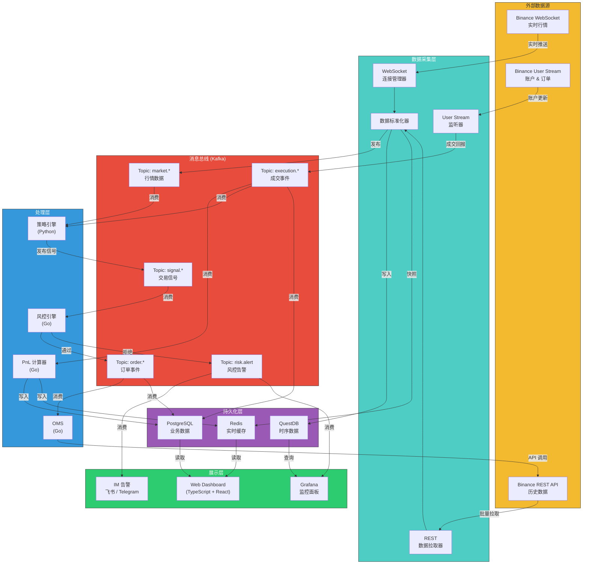

### 5.2 订单执行数据流（详细）

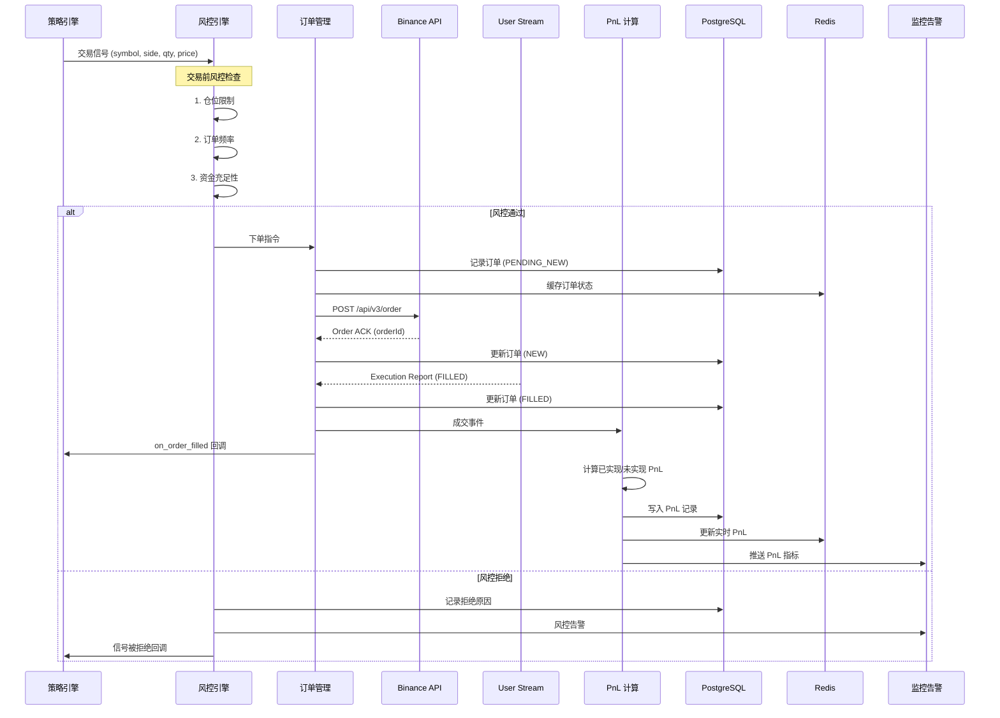

### 5.3 市场数据流（详细）

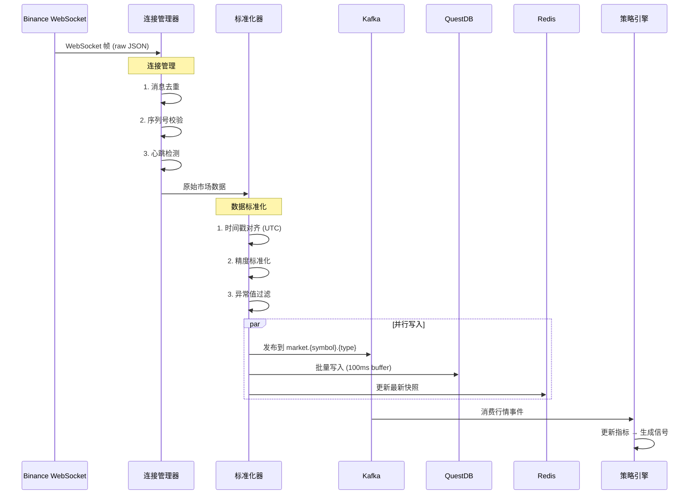

---

## 附录

### A. 关键技术依赖

| 组件 | 版本 | License |
|------|------|---------|
| Python | 3.12+ | PSF |
| Go | 1.22+ | BSD-3 |
| Apache Kafka | 3.7+ | Apache-2.0 |
| QuestDB | 8.0+ | Apache-2.0 |
| PostgreSQL | 16+ | PostgreSQL License |
| Redis | 7.2+ | RSALv2 / SSPLv1 |
| Kubernetes | 1.29+ | Apache-2.0 |
| Prometheus | 2.50+ | Apache-2.0 |
| Grafana | 11+ | AGPL-3.0 |

### B. 名词对照

| 缩写 | 全称 | 中文 |
|------|------|------|
| OMS | Order Management System | 订单管理系统 |
| PnL | Profit and Loss | 盈亏 |
| RTT | Round-Trip Time | 往返延迟 |
| RTO | Recovery Time Objective | 恢复时间目标 |
| RPO | Recovery Point Objective | 恢复点目标 |
| TWAP | Time-Weighted Average Price | 时间加权平均价格 |
| ATR | Average True Range | 平均真实波幅 |
| ISR | In-Sync Replicas | 同步副本集 |
| bps | Basis Points | 基点 (0.01%) |

### C. 参考文档

- [Binance API Documentation](https://binance-docs.github.io/apidocs/)
- [Binance WebSocket Streams](https://binance-docs.github.io/apidocs/spot/en/#websocket-market-streams)
- [QuestDB Documentation](https://questdb.io/docs/)
- [Apache Kafka Documentation](https://kafka.apache.org/documentation/)
